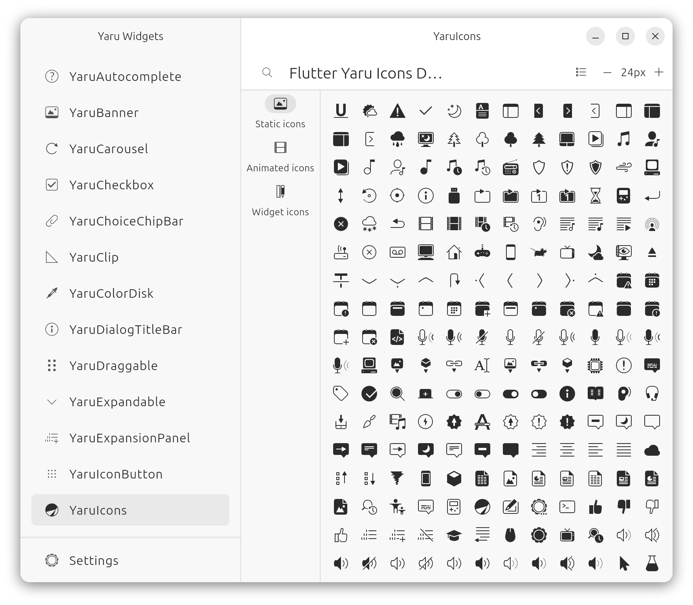

# Flutter Yaru Widgets

[](https://pub.dev/packages/yaru_widgets)

Common flutter widgets useful for building desktop and web applications.


## What is this?

A set of convenient widgets made with `material.dart` to easily build desktop and web applications.
Design references are the [Ubuntu Yaru theme suite](https://github.com/ubuntu/yaru) and the [Vanilla framework](https://vanillaframework.io/) by Canonical.

[LIVE DEMO](https://ubuntu.github.io/yaru_widgets.dart/)

## What it ain't

This is not:

- a new design language
- a hard-copy of GNOME's Adwaita

## Why not build on `foundation.dart` and `widgets.dart`?

You may ask why `yaru_widgets.dart` is not built directly upon `foundation.dart` and `widgets.dart` like for example the [Chicago widget library](https://github.com/tvolkert/chicago).
The answer is that `material.dart` brings functionally everything that one needs to build applications. The sometimes polarizing elevation of the material design language can be easily adjusted with a flutter theme. There is simply no need to build a whole new widget library parallel to `material.dart` or `cupertino.dart` if only the visuals should be changed. Using `material.dart` as a base brings stability to your application and you can be sure that basic widgets, containers and constraints "just work".

So `yaru_widgets.dart` uses the completeness and the level of polish `material.dart` has and adds a set of widgets to it that are useful (but not necessarily the only way) to build desktop and web applications so they all have a consistent look and use the same design patterns.

## Tested themes

Themes inside [`yaru.dart`](https://github.com/ubuntu/yaru.dart) are the only Material themes tested with yaru_widgets and we do not currently recommend to use any other themes.

## Icons

Yaru comes with a set of icons for your Flutter application.

For an overview of all availables icons, please look at the [web Example GitHub Page](https://ubuntu.github.io/yaru_icons.dart/)



# Usage

```dart
import 'package:yaru_icons/widgets/yaru_icons.dart';

...

Icon(YaruIcons.folder)
```

# Contributing

To work on the icons and then build the font, you need to install the [icon_font_generator](https://github.com/rbcprolabs/icon_font_generator) tool:

```console
dart pub global activate -sgit https://github.com/Jupi007/icon_font_generator.git --git-ref yaru
```

Source SVGs files are located inside `./icons`. The final icon name is determined by **subfolder_name** + **icon_name** (Ex: `icons/mimetype/text-plain.svg` will be named `mimetype_text_plain`).

After modifying or adding icons, you must run the build script, which will generate the icon font:

``` console
./build-icons.sh
```

# Copying or Reusing

The theme and widgets are licensed under Mozilla Public License Version 2.0.

The icons have mixed licencing. You are free to copy, redistribute and/or modify aspects of this work under the terms of each licence accordingly (unless otherwise specified).

The icon assets (any and all source .svg files or rendered .ttf font) are licensed under the terms of the Creative Commons Attribution-ShareAlike 4.0 License.

Included scripts are free software licensed under the terms of the GNU General Public License, version 3.
