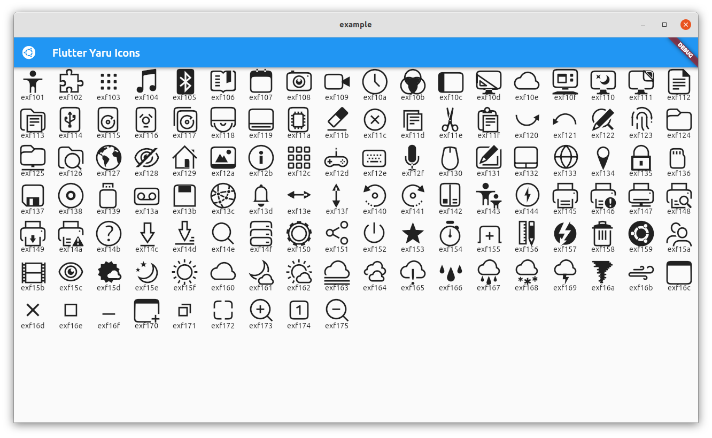

<h1 align="center">Ubuntu Yaru icons for Flutter</h1>


A set of [Yaru](https://github.com/ubuntu/yaru) icons for your Flutter application.



# Usage

```dart
import 'package:yaru_icons/widgets/icons.dart';

...

Icon(YaruIcons.folder)
```

# Contributing

To work on the icons and then build the font, you need to install the [fantasticon_flutter](https://github.com/Jupi007/fantasticon_flutter) tool:

```console
pub global activate fantasticon_flutter
```

Source SVGs files are located inside `./icons`. The final icon name is determined by **subfolder_name** + **icon_name** (Ex: `icons/mimetype/text-plain.svg` will be named `mimetype_text_plain`).

After modifying or adding icons, you must run the build script, which will generate the icon font:

``` console
./build-icons.sh
```

# Copying or Reusing

This project has mixed licencing. You are free to copy, redistribute and/or modify aspects of this work under the terms of each licence accordingly (unless otherwise specified).

The icon assets (any and all source .svg files or rendered .ttf font) are licensed under the terms of the Creative Commons Attribution-ShareAlike 4.0 License.

Included scripts are free software licensed under the terms of the GNU General Public License, version 3.
