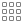

<!-- GENERATED FILE - DO NOT MODIFY BY HAND -->

# Yaru_icons library overview

Icon preview | Icon name | Usage
------------ | --------- | -----
 | accessibility | `YaruIcons.accessibility`
 | addon filled | `YaruIcons.addon_filled`
 | addon | `YaruIcons.addon`
 | address book | `YaruIcons.address_book`
 | app grid | `YaruIcons.app_grid`
 | audio | `YaruIcons.audio`
 | battery level 0 charging | `YaruIcons.battery_level_0_charging`
 | battery level 0 | `YaruIcons.battery_level_0`
 | battery level 100 charging | `YaruIcons.battery_level_100_charging`
 | battery level 100 | `YaruIcons.battery_level_100`
 | battery level 10 charging | `YaruIcons.battery_level_10_charging`
 | battery level 10 | `YaruIcons.battery_level_10`
 | battery level 20 charging | `YaruIcons.battery_level_20_charging`
 | battery level 20 | `YaruIcons.battery_level_20`
 | battery level 30 charging | `YaruIcons.battery_level_30_charging`
 | battery level 30 | `YaruIcons.battery_level_30`
 | battery level 40 charging | `YaruIcons.battery_level_40_charging`
 | battery level 40 | `YaruIcons.battery_level_40`
 | battery level 50 charging | `YaruIcons.battery_level_50_charging`
 | battery level 50 | `YaruIcons.battery_level_50`
 | battery level 60 charging | `YaruIcons.battery_level_60_charging`
 | battery level 60 | `YaruIcons.battery_level_60`
 | battery level 70 charging | `YaruIcons.battery_level_70_charging`
 | battery level 70 | `YaruIcons.battery_level_70`
 | battery level 80 charging | `YaruIcons.battery_level_80_charging`
 | battery level 80 | `YaruIcons.battery_level_80`
 | battery level 90 charging | `YaruIcons.battery_level_90_charging`
 | battery level 90 | `YaruIcons.battery_level_90`
 | battery missing | `YaruIcons.battery_missing`
 | bluetooth | `YaruIcons.bluetooth`
 | bookmarks | `YaruIcons.bookmarks`
 | calendar | `YaruIcons.calendar`
 | call incoming | `YaruIcons.call_incoming`
 | call outgoing | `YaruIcons.call_outgoing`
 | call start | `YaruIcons.call_start`
 | call stop | `YaruIcons.call_stop`
 | camera photo filed | `YaruIcons.camera_photo_filed`
 | camera photo | `YaruIcons.camera_photo`
 | camera video filed | `YaruIcons.camera_video_filed`
 | camera video | `YaruIcons.camera_video`
 | checkbox button checked filled | `YaruIcons.checkbox_button_checked_filled`
 | checkbox button checked | `YaruIcons.checkbox_button_checked`
 | checkbox button filled | `YaruIcons.checkbox_button_filled`
 | checkbox button mixed filled | `YaruIcons.checkbox_button_mixed_filled`
 | checkbox button mixed | `YaruIcons.checkbox_button_mixed`
 | checkbox button | `YaruIcons.checkbox_button`
 | checkmark | `YaruIcons.checkmark`
 | check spelling | `YaruIcons.check_spelling`
 | chip filled | `YaruIcons.chip_filled`
 | chip | `YaruIcons.chip`
 | clock filled | `YaruIcons.clock_filled`
 | clock | `YaruIcons.clock`
 | color select | `YaruIcons.color_select`
 | colors | `YaruIcons.colors`
 | computer | `YaruIcons.computer`
 | desktop display | `YaruIcons.desktop_display`
 | desktop online accounts | `YaruIcons.desktop_online_accounts`
 | desktop panel look | `YaruIcons.desktop_panel_look`
 | desktop remote | `YaruIcons.desktop_remote`
 | desktop screensaver | `YaruIcons.desktop_screensaver`
 | desktop | `YaruIcons.desktop`
 | desktop wallpaper | `YaruIcons.desktop_wallpaper`
 | document open | `YaruIcons.document_open`
 | document | `YaruIcons.document`
 | download | `YaruIcons.download`
 | drag handle | `YaruIcons.drag_handle`
 | drive harddisk filled | `YaruIcons.drive_harddisk_filled`
 | drive harddisk | `YaruIcons.drive_harddisk`
 | drive harddisk usb filled | `YaruIcons.drive_harddisk_usb_filled`
 | drive harddisk usb | `YaruIcons.drive_harddisk_usb`
 | drive ieee1394 filled | `YaruIcons.drive_ieee1394_filled`
 | drive ieee1394 | `YaruIcons.drive_ieee1394`
 | drive multidisk filled | `YaruIcons.drive_multidisk_filled`
 | drive multidisk | `YaruIcons.drive_multidisk`
 | drive optical filled | `YaruIcons.drive_optical_filled`
 | drive optical | `YaruIcons.drive_optical`
 | drive removable media filled | `YaruIcons.drive_removable_media_filled`
 | drive removable media | `YaruIcons.drive_removable_media`
 | drive solidstatedisk filled | `YaruIcons.drive_solidstatedisk_filled`
 | drive solidstatedisk | `YaruIcons.drive_solidstatedisk`
 | edit clear all | `YaruIcons.edit_clear_all`
 | edit clear | `YaruIcons.edit_clear`
 | edit copy | `YaruIcons.edit_copy`
 | edit cut | `YaruIcons.edit_cut`
 | edit paste | `YaruIcons.edit_paste`
 | edit redo | `YaruIcons.edit_redo`
 | edit undo | `YaruIcons.edit_undo`
 | emote angel | `YaruIcons.emote_angel`
 | emote angry | `YaruIcons.emote_angry`
 | emote confused | `YaruIcons.emote_confused`
 | emote cool | `YaruIcons.emote_cool`
 | emote crying | `YaruIcons.emote_crying`
 | emote devilish | `YaruIcons.emote_devilish`
 | emote embarrassed | `YaruIcons.emote_embarrassed`
 | emote glasses | `YaruIcons.emote_glasses`
 | emote kiss | `YaruIcons.emote_kiss`
 | emote laugh | `YaruIcons.emote_laugh`
 | emote monkey | `YaruIcons.emote_monkey`
 | emote plain | `YaruIcons.emote_plain`
 | emote raspberry | `YaruIcons.emote_raspberry`
 | emote sad | `YaruIcons.emote_sad`
 | emote shutmouth | `YaruIcons.emote_shutmouth`
 | emote sick | `YaruIcons.emote_sick`
 | emote smile big | `YaruIcons.emote_smile_big`
 | emote smile | `YaruIcons.emote_smile`
 | emote smirk | `YaruIcons.emote_smirk`
 | emote surprise | `YaruIcons.emote_surprise`
 | emote tired | `YaruIcons.emote_tired`
 | emote uncertain | `YaruIcons.emote_uncertain`
 | emote wink | `YaruIcons.emote_wink`
 | emote worried | `YaruIcons.emote_worried`
 | emote yawn | `YaruIcons.emote_yawn`
 | error filled | `YaruIcons.error_filled`
 | error | `YaruIcons.error`
 | executable | `YaruIcons.executable`
 | find location filled | `YaruIcons.find_location_filled`
 | find location | `YaruIcons.find_location`
 | find replace | `YaruIcons.find_replace`
 | fingerprint | `YaruIcons.fingerprint`
 | folder remote | `YaruIcons.folder_remote`
 | folder search | `YaruIcons.folder_search`
 | folder | `YaruIcons.folder`
 | font | `YaruIcons.font`
 | format indent less | `YaruIcons.format_indent_less`
 | format indent more | `YaruIcons.format_indent_more`
 | format justify center | `YaruIcons.format_justify_center`
 | format justify fill | `YaruIcons.format_justify_fill`
 | format justify left | `YaruIcons.format_justify_left`
 | format justify right | `YaruIcons.format_justify_right`
 | format ordered list | `YaruIcons.format_ordered_list`
 | format text bold | `YaruIcons.format_text_bold`
 | format text direction ltr | `YaruIcons.format_text_direction_ltr`
 | format text direction rtl | `YaruIcons.format_text_direction_rtl`
 | format text italic | `YaruIcons.format_text_italic`
 | format text remove | `YaruIcons.format_text_remove`
 | format text strikethrough | `YaruIcons.format_text_strikethrough`
 | format text underline | `YaruIcons.format_text_underline`
 | format unordered list | `YaruIcons.format_unordered_list`
 | globe filled | `YaruIcons.globe_filled`
 | globe | `YaruIcons.globe`
 | go bottom | `YaruIcons.go_bottom`
 | go down | `YaruIcons.go_down`
 | go first | `YaruIcons.go_first`
 | go jump | `YaruIcons.go_jump`
 | go last | `YaruIcons.go_last`
 | go next | `YaruIcons.go_next`
 | go previous | `YaruIcons.go_previous`
 | go top | `YaruIcons.go_top`
 | go up | `YaruIcons.go_up`
 | headphones | `YaruIcons.headphones`
 | headset | `YaruIcons.headset`
 | heart filled | `YaruIcons.heart_filled`
 | heart | `YaruIcons.heart`
 | hide filled | `YaruIcons.hide_filled`
 | hide | `YaruIcons.hide`
 | home filled | `YaruIcons.home_filled`
 | home | `YaruIcons.home`
 | hourglass filled | `YaruIcons.hourglass_filled`
 | hourglass | `YaruIcons.hourglass`
 | image filled | `YaruIcons.image_filled`
 | image | `YaruIcons.image`
 | information filled | `YaruIcons.information_filled`
 | information | `YaruIcons.information`
 | input dialpad | `YaruIcons.input_dialpad`
 | input gaming | `YaruIcons.input_gaming`
 | input keyboard | `YaruIcons.input_keyboard`
 | input mouse | `YaruIcons.input_mouse`
 | input tablet | `YaruIcons.input_tablet`
 | input touchpad | `YaruIcons.input_touchpad`
 | insert image | `YaruIcons.insert_image`
 | insert link | `YaruIcons.insert_link`
 | insert object | `YaruIcons.insert_object`
 | insert text | `YaruIcons.insert_text`
 | keyboard shortcuts filled | `YaruIcons.keyboard_shortcuts_filled`
 | keyboard shortcuts | `YaruIcons.keyboard_shortcuts`
 | key filled | `YaruIcons.key_filled`
 | key | `YaruIcons.key`
 | localization | `YaruIcons.localization`
 | location | `YaruIcons.location`
 | lock filled | `YaruIcons.lock_filled`
 | lock | `YaruIcons.lock`
 | log out | `YaruIcons.log_out`
 | mail forward | `YaruIcons.mail_forward`
 | mail inbox filled | `YaruIcons.mail_inbox_filled`
 | mail inbox | `YaruIcons.mail_inbox`
 | mail mark important filled | `YaruIcons.mail_mark_important_filled`
 | mail mark important | `YaruIcons.mail_mark_important`
 | mail mark junk filled | `YaruIcons.mail_mark_junk_filled`
 | mail mark junk | `YaruIcons.mail_mark_junk`
 | mail outbox filled | `YaruIcons.mail_outbox_filled`
 | mail outbox | `YaruIcons.mail_outbox`
 | mail reply all | `YaruIcons.mail_reply_all`
 | mail reply | `YaruIcons.mail_reply`
 | mail send filled | `YaruIcons.mail_send_filled`
 | mail send receive | `YaruIcons.mail_send_receive`
 | mail send | `YaruIcons.mail_send`
 | media eject | `YaruIcons.media_eject`
 | media flash filled | `YaruIcons.media_flash_filled`
 | media flash | `YaruIcons.media_flash`
 | media floppy filled | `YaruIcons.media_floppy_filled`
 | media floppy | `YaruIcons.media_floppy`
 | media optical filled | `YaruIcons.media_optical_filled`
 | media optical | `YaruIcons.media_optical`
 | media playback pause | `YaruIcons.media_playback_pause`
 | media playback start | `YaruIcons.media_playback_start`
 | media playback stop | `YaruIcons.media_playback_stop`
 | media record | `YaruIcons.media_record`
 | media removable filled | `YaruIcons.media_removable_filled`
 | media removable | `YaruIcons.media_removable`
 | media seek backward | `YaruIcons.media_seek_backward`
 | media seek forward | `YaruIcons.media_seek_forward`
 | media skip backward | `YaruIcons.media_skip_backward`
 | media skip forward | `YaruIcons.media_skip_forward`
 | media tape filled | `YaruIcons.media_tape_filled`
 | media tape | `YaruIcons.media_tape`
 | media zip filled | `YaruIcons.media_zip_filled`
 | media zip | `YaruIcons.media_zip`
 | menu | `YaruIcons.menu`
 | meter 1 | `YaruIcons.meter_1`
 | meter 2 | `YaruIcons.meter_2`
 | meter 3 | `YaruIcons.meter_3`
 | meter 4 | `YaruIcons.meter_4`
 | meter 5 | `YaruIcons.meter_5`
 | microphone filled | `YaruIcons.microphone_filled`
 | microphone | `YaruIcons.microphone`
 | microphone volume high filled | `YaruIcons.microphone_volume_high_filled`
 | microphone volume high | `YaruIcons.microphone_volume_high`
 | microphone volume low filled | `YaruIcons.microphone_volume_low_filled`
 | microphone volume low | `YaruIcons.microphone_volume_low`
 | microphone volume medium filled | `YaruIcons.microphone_volume_medium_filled`
 | microphone volume medium | `YaruIcons.microphone_volume_medium`
 | microphone volume muted filled | `YaruIcons.microphone_volume_muted_filled`
 | microphone volume muted | `YaruIcons.microphone_volume_muted`
 | minus | `YaruIcons.minus`
 | multimedia player filled | `YaruIcons.multimedia_player_filled`
 | multimedia player | `YaruIcons.multimedia_player`
 | network cellular 2g | `YaruIcons.network_cellular_2g`
 | network cellular 3g | `YaruIcons.network_cellular_3g`
 | network cellular 4g | `YaruIcons.network_cellular_4g`
 | network cellular 5g | `YaruIcons.network_cellular_5g`
 | network cellular acquiring | `YaruIcons.network_cellular_acquiring`
 | network cellular connected | `YaruIcons.network_cellular_connected`
 | network cellular disabled | `YaruIcons.network_cellular_disabled`
 | network cellular edge | `YaruIcons.network_cellular_edge`
 | network cellular gprs | `YaruIcons.network_cellular_gprs`
 | network cellular hardware disabled | `YaruIcons.network_cellular_hardware_disabled`
 | network cellular hspa | `YaruIcons.network_cellular_hspa`
 | network cellular no route | `YaruIcons.network_cellular_no_route`
 | network cellular offline | `YaruIcons.network_cellular_offline`
 | network cellular signal excellent secure | `YaruIcons.network_cellular_signal_excellent_secure`
 | network cellular signal excellent | `YaruIcons.network_cellular_signal_excellent`
 | network cellular signal good secure | `YaruIcons.network_cellular_signal_good_secure`
 | network cellular signal good | `YaruIcons.network_cellular_signal_good`
 | network cellular signal none secure | `YaruIcons.network_cellular_signal_none_secure`
 | network cellular signal none | `YaruIcons.network_cellular_signal_none`
 | network cellular signal ok secure | `YaruIcons.network_cellular_signal_ok_secure`
 | network cellular signal ok | `YaruIcons.network_cellular_signal_ok`
 | network cellular signal weak secure | `YaruIcons.network_cellular_signal_weak_secure`
 | network cellular signal weak | `YaruIcons.network_cellular_signal_weak`
 | network cellular | `YaruIcons.network_cellular`
 | network filled | `YaruIcons.network_filled`
 | network hotspot | `YaruIcons.network_hotspot`
 | network | `YaruIcons.network`
 | network wired | `YaruIcons.network_wired`
 | network wireless acquiring | `YaruIcons.network_wireless_acquiring`
 | network wireless disabled | `YaruIcons.network_wireless_disabled`
 | network wireless no route | `YaruIcons.network_wireless_no_route`
 | network wireless signal excellent secure | `YaruIcons.network_wireless_signal_excellent_secure`
 | network wireless signal excellent | `YaruIcons.network_wireless_signal_excellent`
 | network wireless signal good secure | `YaruIcons.network_wireless_signal_good_secure`
 | network wireless signal good | `YaruIcons.network_wireless_signal_good`
 | network wireless signal none secure | `YaruIcons.network_wireless_signal_none_secure`
 | network wireless signal none | `YaruIcons.network_wireless_signal_none`
 | network wireless signal ok secure | `YaruIcons.network_wireless_signal_ok_secure`
 | network wireless signal ok | `YaruIcons.network_wireless_signal_ok`
 | network wireless signal weak secure | `YaruIcons.network_wireless_signal_weak_secure`
 | network wireless signal weak | `YaruIcons.network_wireless_signal_weak`
 | network wireless | `YaruIcons.network_wireless`
 | notification filled | `YaruIcons.notification_filled`
 | notification | `YaruIcons.notification`
 | object flip horizontal | `YaruIcons.object_flip_horizontal`
 | object flip vertical | `YaruIcons.object_flip_vertical`
 | object rotate left | `YaruIcons.object_rotate_left`
 | object rotate right | `YaruIcons.object_rotate_right`
 | ok filled | `YaruIcons.ok_filled`
 | ok simple | `YaruIcons.ok_simple`
 | ok | `YaruIcons.ok`
 | package filled | `YaruIcons.package_filled`
 | package | `YaruIcons.package`
 | pan down | `YaruIcons.pan_down`
 | pan end | `YaruIcons.pan_end`
 | pan start | `YaruIcons.pan_start`
 | pan up | `YaruIcons.pan_up`
 | parental controls | `YaruIcons.parental_controls`
 | pen | `YaruIcons.pen`
 | phone old filled | `YaruIcons.phone_old_filled`
 | phone old | `YaruIcons.phone_old`
 | pin | `YaruIcons.pin`
 | plus | `YaruIcons.plus`
 | power filled | `YaruIcons.power_filled`
 | power | `YaruIcons.power`
 | printer error | `YaruIcons.printer_error`
 | printer network | `YaruIcons.printer_network`
 | printer preview | `YaruIcons.printer_preview`
 | printer printing | `YaruIcons.printer_printing`
 | printer | `YaruIcons.printer`
 | printer warning | `YaruIcons.printer_warning`
 | private mask filled | `YaruIcons.private_mask_filled`
 | private mask | `YaruIcons.private_mask`
 | question filled | `YaruIcons.question_filled`
 | question | `YaruIcons.question`
 | radio button checked filled | `YaruIcons.radio_button_checked_filled`
 | radio button checked | `YaruIcons.radio_button_checked`
 | radio button filled | `YaruIcons.radio_button_filled`
 | radio button mixed filled | `YaruIcons.radio_button_mixed_filled`
 | radio button mixed | `YaruIcons.radio_button_mixed`
 | radio button | `YaruIcons.radio_button`
 | refresh | `YaruIcons.refresh`
 | rss | `YaruIcons.rss`
 | save as | `YaruIcons.save_as`
 | save | `YaruIcons.save`
 | search | `YaruIcons.search`
 | selection | `YaruIcons.selection`
 | server | `YaruIcons.server`
 | settings filled | `YaruIcons.settings_filled`
 | settings | `YaruIcons.settings`
 | share | `YaruIcons.share`
 | shield | `YaruIcons.shield`
 | shutdown | `YaruIcons.shutdown`
 | sidebar hide right | `YaruIcons.sidebar_hide_right`
 | sidebar hide | `YaruIcons.sidebar_hide`
 | sidebar right | `YaruIcons.sidebar_right`
 | sidebar | `YaruIcons.sidebar`
 | smartphone | `YaruIcons.smartphone`
 | speaker filled | `YaruIcons.speaker_filled`
 | speaker | `YaruIcons.speaker`
 | speaker volume high filled | `YaruIcons.speaker_volume_high_filled`
 | speaker volume high | `YaruIcons.speaker_volume_high`
 | speaker volume low filled | `YaruIcons.speaker_volume_low_filled`
 | speaker volume low | `YaruIcons.speaker_volume_low`
 | speaker volume medium filled | `YaruIcons.speaker_volume_medium_filled`
 | speaker volume medium | `YaruIcons.speaker_volume_medium`
 | speaker volume muted filled | `YaruIcons.speaker_volume_muted_filled`
 | speaker volume muted | `YaruIcons.speaker_volume_muted`
 | speaker volume overamplified filled | `YaruIcons.speaker_volume_overamplified_filled`
 | speaker volume overamplified | `YaruIcons.speaker_volume_overamplified`
 | star filled | `YaruIcons.star_filled`
 | star semi filled | `YaruIcons.star_semi_filled`
 | star | `YaruIcons.star`
 | stop | `YaruIcons.stop`
 | stopwatch filled | `YaruIcons.stopwatch_filled`
 | stopwatch | `YaruIcons.stopwatch`
 | subtitles filled | `YaruIcons.subtitles_filled`
 | subtitles | `YaruIcons.subtitles`
 | tablet | `YaruIcons.tablet`
 | tab new filled | `YaruIcons.tab_new_filled`
 | tab new | `YaruIcons.tab_new`
 | tag filled | `YaruIcons.tag_filled`
 | tag | `YaruIcons.tag`
 | television | `YaruIcons.television`
 | template | `YaruIcons.template`
 | thunderbolt | `YaruIcons.thunderbolt`
 | trash full | `YaruIcons.trash_full`
 | trash | `YaruIcons.trash`
 | tree filled | `YaruIcons.tree_filled`
 | tree fir filled | `YaruIcons.tree_fir_filled`
 | tree fir | `YaruIcons.tree_fir`
 | tree | `YaruIcons.tree`
 | ubuntu logo large | `YaruIcons.ubuntu_logo_large`
 | ubuntu logo | `YaruIcons.ubuntu_logo`
 | users | `YaruIcons.users`
 | user | `YaruIcons.user`
 | video | `YaruIcons.video`
 | view filled | `YaruIcons.view_filled`
 | view fullscreen | `YaruIcons.view_fullscreen`
 | view more horizontal | `YaruIcons.view_more_horizontal`
 | view more | `YaruIcons.view_more`
 | view restore | `YaruIcons.view_restore`
 | view | `YaruIcons.view`
 | warning filled | `YaruIcons.warning_filled`
 | warning | `YaruIcons.warning`
 | weather clear night | `YaruIcons.weather_clear_night`
 | weather clear | `YaruIcons.weather_clear`
 | weather cloudy | `YaruIcons.weather_cloudy`
 | weather few clouds night | `YaruIcons.weather_few_clouds_night`
 | weather few clouds | `YaruIcons.weather_few_clouds`
 | weather fog | `YaruIcons.weather_fog`
 | weather overcast | `YaruIcons.weather_overcast`
 | weather severe alert | `YaruIcons.weather_severe_alert`
 | weather showers scattered | `YaruIcons.weather_showers_scattered`
 | weather showers | `YaruIcons.weather_showers`
 | weather snow | `YaruIcons.weather_snow`
 | weather storm | `YaruIcons.weather_storm`
 | weather | `YaruIcons.weather`
 | weather tornado | `YaruIcons.weather_tornado`
 | weather windy | `YaruIcons.weather_windy`
 | window close | `YaruIcons.window_close`
 | window maximize | `YaruIcons.window_maximize`
 | window minimize | `YaruIcons.window_minimize`
 | window new | `YaruIcons.window_new`
 | window restore | `YaruIcons.window_restore`
 | windows | `YaruIcons.windows`
 | window | `YaruIcons.window`
 | window top bar | `YaruIcons.window_top_bar`
 | zoom fit best | `YaruIcons.zoom_fit_best`
 | zoom in | `YaruIcons.zoom_in`
 | zoom original | `YaruIcons.zoom_original`
 | zoom out | `YaruIcons.zoom_out`
